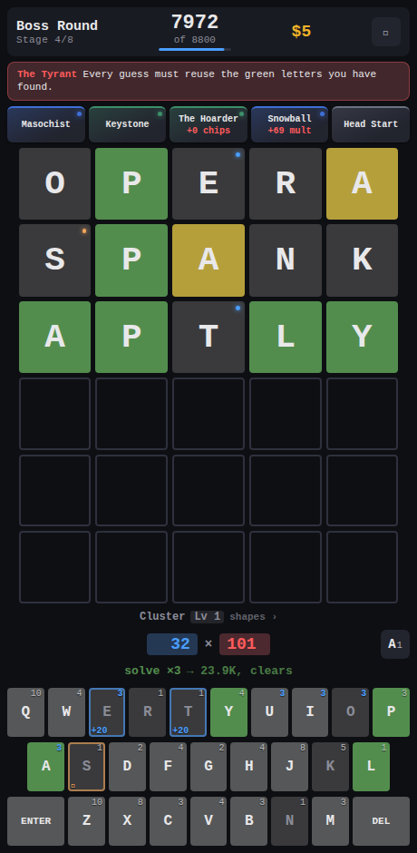

# 5 Wild

**A word game that turns into a numbers game.** Guess the five letter word, but
every guess you play is also a hand you score. Letters carry chip values, the
green and yellow feedback carries the multiplier, and the relics you buy between
rounds quietly rewrite the arithmetic underneath all of it. Beat the target,
shop, and see how far up the ladder you get.

  

## The hook

You get six guesses, fewer if the boss says so, and one decision to make with
each of them.

Guess to *learn* and you narrow the word down, but a guess made of cheap letters
scores almost nothing. Guess to *earn* and you can stack fat letters, echoes and
steel into a monster of a hand, but you are burning a guess you might need.
Solving pays a fat tempo bonus and ends the round on the spot, which is exactly
the problem: the round you end early is the round you stopped farming.

That squeeze is the whole game, and it gets tighter every stage.

## What you are playing with

**Relics.** Twenty eight of them, bought from the shop between rounds, and they
stack. Snowball permanently gains mult for every green tile you play.
Bloodhound pays you for yellows, so a near miss stops feeling like one. Q's
Bargain scores J, Q, X and Z at triple chips and turns the worst letters in the
alphabet into the ones you go hunting for. The run you finish never looks like
the run you started.

**Letter modifiers.** Buy an upgrade onto a letter and it follows that letter
for the rest of the run. Steel doubles your mult whenever you play it. Glass
triples it and might shatter. Wild pays you *more* for being wrong, which is a
strange and wonderful thing to build a strategy around.

**Bosses.** Fifteen of them, one every third round, and each breaks a rule you
were relying on. The Fog makes yellow and gray look identical, though they still
score differently. The Tyrant demands that every guess reuse the greens you have
found. The Mirror shows your feedback back to front. The Drought stops paying
you for vowels. They are responsible for most of the deaths in this game, and
there are numbers further down to prove it.

**Consumables.** Four one shot cards you hold until the moment they matter. The
Oracle hands you a letter in place. The Hermit rules one out for free. The
Magician promotes your next gray tile to yellow. The Fool scores your last guess
all over again, which is how a good hand becomes a great one.

**Etchings and categories.** The shop also sells etchings, which make a whole
group of letters worth more chips for the rest of the run, and packs that level
up a word category, so Clusters, Twinned words or whatever shape you keep
reaching for starts paying more every time you play it.

**Eight stages, then the ladder.** Win a run and ten ascensions open up above
it, and each one is a new rule to fight rather than just a bigger number. Clear
those and there are ninety harder rungs still waiting.

Play it in English, Spanish, French or German. Each language brings its own word
list and its own keyboard, so a French run is AZERTY and a German one is QWERTZ.

## Play it

**On the web:** <https://5-wild.com>

**On Android:** download and install the APK straight from your phone's browser,
no store account and no cable.

**<https://github.com/jmelahman/5-wild/releases/latest/download/5-wild.apk>**

Android asks permission to install from the browser the first time. Everything
the game needs ships inside the package, word lists included, so it plays with
no network at all. Your run and your records are saved on the device.

**From source:** `npm ci && npm run dev` puts it on <http://localhost:5173>.
`CONTRIBUTING.md` has the rest.
